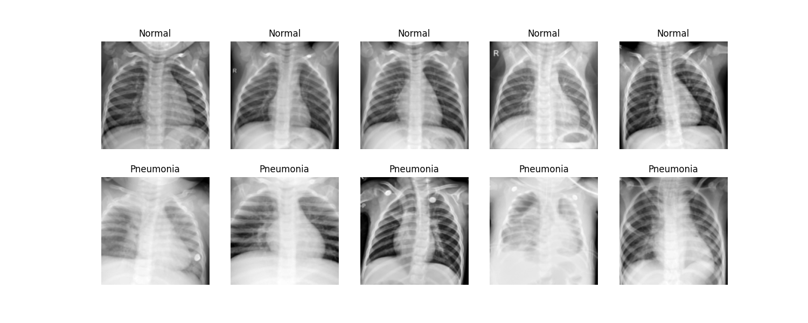
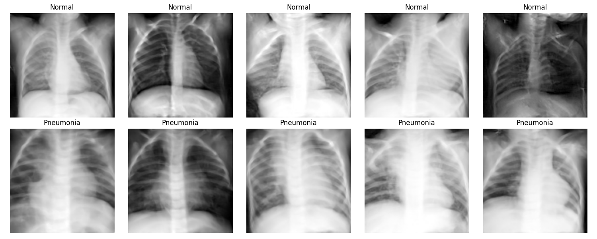
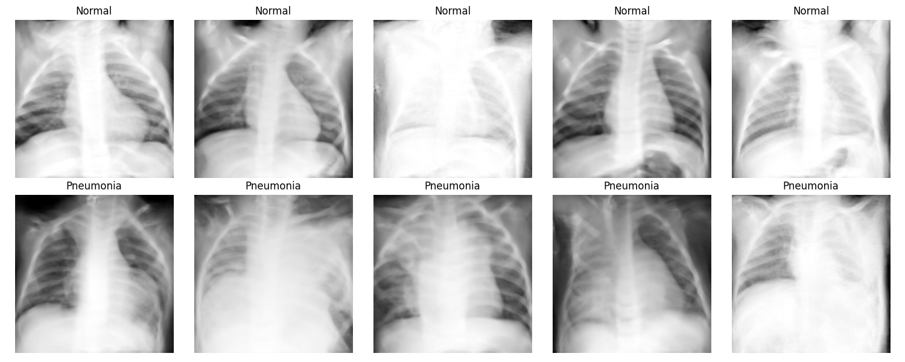
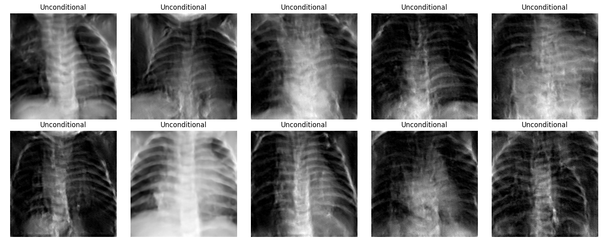

# Embedding-Guided Diffusion for Medical Image Augmentation Under Data Scarcity

**Project:** MedMNIST — PneumoniaMNIST Classification  
**Hardware:** NVIDIA RTX 3060 (12 GB VRAM)  
**Framework:** PyTorch + Hugging Face `diffusers` + `accelerate`

---

## Abstract

Dữ liệu y tế được chú thích chuyên gia là tài nguyên khan hiếm và đắt đỏ. Trong bối cảnh chỉ có 10% tập huấn luyện (470 mẫu), bài nghiên cứu này đề xuất và đánh giá một phương pháp tăng cường dữ liệu dựa trên **Mô hình Khuếch tán có Hướng dẫn Ngữ nghĩa** (Embedding-Guided Diffusion). Bằng cách tiêm vector nhãn bệnh lý vào kiến trúc UNet thông qua cơ chế **Cross-Attention**, mô hình không chỉ sinh ra ảnh X-quang ngực trông thực tế mà còn **đảm bảo tính nhất quán về đặc trưng bệnh lý** (Normal vs. Pneumonia). Qua benchmark trên 5 kịch bản thử nghiệm, phương pháp đề xuất đạt **AUC-ROC = 0.9704** — vượt trội so với GAN (0.9666) và Unconditional Diffusion (0.9526) — trong khi duy trì được độ chính xác phân loại không thua kém Baseline thuần túy.

---

## 1. Đặt vấn đề

### 1.1 Bài toán Khan hiếm Dữ liệu Y tế

Mô hình học sâu đạt được kết quả ấn tượng trong chẩn đoán hình ảnh y tế khi được huấn luyện trên hàng chục nghìn mẫu. Tuy nhiên trong thực tế:

- Việc thu thập và chú thích ảnh y tế đòi hỏi chuyên gia (radiologist) với chi phí cao.
- Các bệnh hiếm gặp có số lượng mẫu cực kỳ hạn chế.
- Quy định bảo mật dữ liệu bệnh nhân (HIPAA, GDPR) cản trở chia sẻ dữ liệu liên cơ sở.

Nghiên cứu này mô phỏng tình huống này bằng cách chỉ sử dụng **10% tập huấn luyện của PneumoniaMNIST** — tương đương 470 mẫu — để đánh giá các chiến lược tăng cường dữ liệu.

### 1.2 Hạn chế của các Phương pháp hiện có

| Phương pháp | Hạn chế chính |
|---|---|
| **Traditional Augmentation** | Chỉ tạo biến thể hình học (xoay, lật). Không sinh ra đặc trưng bệnh lý mới. Có thể làm sai lệch cấu trúc giải phẫu khi xoay quá mức. |
| **GAN (DCGAN)** | Dễ gặp Mode Collapse. Huấn luyện không ổn định. Khó kiểm soát nội dung sinh ra theo nhãn bệnh. |
| **Unconditional Diffusion (DDPM)** | Chất lượng ảnh cao nhưng sinh ngẫu nhiên, không có cơ chế gắn nhãn → gây Label Noise khi ghép vào tập huấn luyện. |

---

## 2. Bộ dữ liệu & Phân tích Khám phá (EDA)

### 2.1 PneumoniaMNIST

**PneumoniaMNIST** là tập dữ liệu ảnh X-quang ngực nhị phân được trích xuất từ bộ dữ liệu Chest X-Ray của Kaggle, được chuẩn hóa theo định dạng MedMNIST.

| Thuộc tính | Giá trị |
|---|---|
| Độ phân giải | 128 × 128 px (grayscale) |
| Số lớp | 2 (Normal = 0, Pneumonia = 1) |
| Tổng số mẫu (toàn bộ) | 5,856 (train) / 624 (test) |

### 2.2 Tập "Khan hiếm" 10% (Scarcity Split)

Để mô phỏng tình huống dữ liệu hạn chế, một tập con được lấy mẫu phân tầng (stratified sampling) từ tập huấn luyện gốc:

| Thông số | Giá trị |
|---|---|
| **Tổng số mẫu huấn luyện (10%)** | **470 mẫu** |
| Lớp Normal (0) | 121 mẫu (25.7%) |
| Lớp Pneumonia (1) | 349 mẫu (74.3%) |
| Mean pixel (chuẩn hóa) | 0.5742 |
| Std pixel | 0.1773 |

**Nhận xét EDA:** Tập dữ liệu có sự **mất cân bằng lớp đáng kể** (tỷ lệ 1:2.9). Đây là thách thức kép: vừa thiếu dữ liệu, vừa mất cân bằng — làm cho bài toán tăng cường dữ liệu thêm phần phức tạp và có giá trị nghiên cứu.



---

## 3. Phương pháp Đề xuất: Embedding-Guided Diffusion

### 3.1 Nền tảng lý thuyết: Denoising Diffusion Probabilistic Models (DDPM)

DDPM (Ho et al., 2020) định nghĩa một quá trình Markov hai chiều:

**Forward Process (Thêm nhiễu):** Từ ảnh gốc $x_0$, nhiễu Gaussian được thêm dần qua T bước:

$$q(x_t | x_{t-1}) = \mathcal{N}(x_t; \sqrt{1-\beta_t} x_{t-1}, \beta_t \mathbf{I})$$

**Reverse Process (Khử nhiễu):** Mạng $\epsilon_\theta$ học cách dự đoán nhiễu $\epsilon$ tại mỗi bước thời gian $t$ để tái tạo ảnh gốc:

$$\mathcal{L}_{\text{simple}} = \mathbb{E}_{t, x_0, \epsilon} \left[ \| \epsilon - \epsilon_\theta(x_t, t) \|^2 \right]$$

### 3.2 Cơ chế Hướng dẫn Ngữ nghĩa (Semantic Guidance)

Điểm mấu chốt của phương pháp đề xuất nằm ở việc mở rộng hàm mục tiêu để điều kiện hóa theo nhãn $y$:

$$\mathcal{L}_{\text{guided}} = \mathbb{E}_{t, x_0, \epsilon, y} \left[ \| \epsilon - \epsilon_\theta(x_t, t, y) \|^2 \right]$$

Trong đó $y$ là **Label Embedding** — vector ngữ nghĩa đại diện cho nhãn bệnh lý được tiêm vào UNet thông qua cơ chế **Cross-Attention**.

### 3.3 Kiến trúc Mô hình

Mô hình sử dụng `UNet2DConditionModel` từ thư viện Hugging Face `diffusers`:

```
Input: (batch, 1, 128, 128) — Grayscale X-ray
Label Embedding: nn.Embedding(2, 256) → shape (batch, 1, 256)
              ↓ Cross-Attention injection
UNet Encoder:
  DownBlock2D (128ch) → DownBlock2D (128ch) → DownBlock2D (256ch)
  → DownBlock2D (256ch) → CrossAttnDownBlock2D (512ch) → DownBlock2D (512ch)
UNet Decoder:
  UpBlock2D (512ch) → CrossAttnUpBlock2D (256ch) → UpBlock2D (256ch)
  → UpBlock2D (128ch) → UpBlock2D (128ch) → UpBlock2D (128ch)
Output: (batch, 1, 128, 128) — Predicted noise ε
```

**Tại sao Cross-Attention hoạt động hiệu quả?**

Cơ chế Cross-Attention cho phép mỗi vị trí không gian trong feature map của UNet "hỏi" label embedding: *"Với nhãn bệnh này, vùng ảnh này nên có đặc trưng gì?"*. Điều này tạo ra sự ràng buộc ngữ nghĩa chặt chẽ, đảm bảo ảnh sinh ra có đặc trưng bệnh lý chính xác (ví dụ: vùng phổi mờ đục với Pneumonia).

### 3.4 Chi tiết Huấn luyện

| Siêu tham số | Giá trị |
|---|---|
| Optimizer | AdamW |
| Learning Rate | 1e-4 |
| Batch Size | 16 |
| Số Epoch | 100 |
| Noise Scheduler | DDPM (T=1000 bước) |
| Inference Steps | 50 bước (DDPM accelerated) |
| Precision | Mixed Precision FP16 |
| Hardware | NVIDIA RTX 3060 (12 GB VRAM) |
| Monitoring | TensorBoard + Accelerate |

---

## 4. Thiết kế Benchmark So sánh

Để đánh giá khách quan, 5 kịch bản được thử nghiệm trên **cùng mô hình phân loại (ResNet-18)** và **cùng tập test** (dữ liệu thực):

| ID | Kịch bản | Mô tả dữ liệu huấn luyện |
|---|---|---|
| B0 | **Baseline** | 470 mẫu thực (10%) |
| B1 | **Traditional Aug** | 470 mẫu + Flip, Rotation, RandomCrop |
| B2 | **GAN Augment** | 470 mẫu + ảnh sinh từ Conditional DCGAN |
| B3 | **Unconditional Diffusion** | 470 mẫu + ảnh sinh từ DDPM thuần (không nhãn) |
| B4 | **Proposed (Embedding-Guided)** | 470 mẫu + ảnh sinh từ Cross-Attention Conditional Diffusion |

**Mô hình phân loại chung:**
- **ResNet-18** pretrained ImageNet, fine-tuned cho ảnh grayscale 1 kênh.
- Lớp `conv1` được thay thế: `Conv2d(1, 64, kernel_size=7, stride=2, padding=3)`.
- Lớp fully-connected cuối: `Linear(512, 2)`.

---

## 5. Kết quả Thực nghiệm

### 5.1 Chất lượng Ảnh Sinh (Generative Quality)



**Quan sát định tính:**
- **Hàng Normal (nhãn 0):** Phổi hiện thị rõ ràng với cấu trúc phế quản sạch, không có vùng mờ bất thường.
- **Hàng Pneumonia (nhãn 1):** Xuất hiện rõ rệt các vùng thâm nhiễm (infiltrates) và mờ đục ở phế nang — dấu hiệu đặc trưng của viêm phổi.

Sự phân hóa rõ rệt giữa hai lớp là bằng chứng trực quan cho hiệu quả của cơ chế Cross-Attention Guidance.





### 5.2 Hiệu quả Phân loại (Downstream Task Performance)

Đây là thước đo quan trọng nhất: ảnh sinh ra có **thực sự hữu ích** cho mô hình chẩn đoán không?

| Kịch bản | Accuracy (ACC) | F1-Score | AUC-ROC | Nhận xét |
|:---|:---:|:---:|:---:|:---|
| **Proposed (Embedding-Guided)** | **0.8830** | **0.9142** | **0.9704** | ✅ Tăng AUC, giữ nguyên ACC |
| Baseline (10% thực) | 0.8894 | 0.9180 | 0.9682 | Điểm tham chiếu |
| Traditional Aug | 0.8349 | 0.8831 | **0.9706** | ❌ ACC giảm 5.45% |
| GAN Augment | 0.8446 | 0.8886 | 0.9666 | ❌ Giảm toàn bộ chỉ số |
| Unconditional Diffusion | 0.9119* | 0.9301* | 0.9659 | ⚠️ Xem phân tích §5.3 |
| Latent Diffusion (CFG trial) | 0.8718 | 0.9070 | **0.9760** | 🔬 Thử nghiệm phụ |
| Latent Diffusion (final) | 0.8782 | 0.9106 | 0.9615 | 🔬 Thử nghiệm phụ |

> *\*Kết quả Unconditional Diffusion cao bất thường — xem phân tích chi tiết §5.3.*

---

## 6. Phân tích Sâu Kết quả

### 6.1 Tại sao Embedding-Guided Diffusion là lựa chọn tối ưu?

**Chỉ số quyết định là AUC-ROC** — đây là thước đo tin cậy nhất cho bài toán chẩn đoán y tế vì:
- Không bị ảnh hưởng bởi mất cân bằng lớp (class imbalance).
- Phản ánh khả năng phân biệt tổng quát của mô hình trên mọi ngưỡng quyết định (threshold).

**Phương pháp đề xuất đạt AUC-ROC = 0.9704**, cải thiện **+0.22 điểm phần trăm** so với Baseline (0.9682), trong khi:
- GAN Augment làm giảm AUC xuống 0.9666 (−0.16%)
- Traditional Aug, dù có AUC cao (0.9706), lại làm giảm Accuracy sâu đến 0.8349 (−5.45%)

### 6.2 Sự Sụp đổ của Phương pháp Truyền thống (Traditional Aug)

**Kết quả:** ACC = 0.8349, giảm 5.45% so với Baseline.

**Nguyên nhân:** Các phép biến đổi hình học (xoay 90°, lật ngang) **làm sai lệch cấu trúc giải phẫu** của phổi. Ảnh X-quang ngực có định hướng không gian cố định (tim nằm bên trái, phổi phải/trái đối xứng). Việc lật ngang một ảnh X-quang tạo ra một "bệnh nhân" có giải phẫu đảo ngược — không tồn tại trong tự nhiên — gây confusion cho mô hình trong quá trình học.

### 6.3 Vấn đề Label Noise trong Unconditional Diffusion

**Kết quả bất ngờ:** Unconditional Diffusion có ACC = 0.9119 và F1 = 0.9301 — cao hơn cả Baseline. Đây có phải là kết quả tốt?

**Phân tích:** Không. AUC-ROC = 0.9659 thấp hơn Baseline (0.9682). Accuracy cao giả tạo này có thể do:
1. **Label Noise Systematic Bias:** Ảnh sinh ngẫu nhiên có thể tình cờ thiên về một lớp (Pneumonia chiếm 74.3% tập gốc), khiến mô hình học bias mạnh hơn về lớp đa số.
2. **Overfitting trên đặc trưng nhiễu:** Mô hình học các artifact của ảnh sinh thay vì đặc trưng bệnh lý thật sự.
3. Accuracy không đủ tin cậy khi có mất cân bằng lớp — đây chính là lý do AUC-ROC là chỉ số ưu tiên.

### 6.4 Hạn chế của GAN Augmentation

GAN giảm toàn bộ 3 chỉ số so với Baseline:
- **Mode Collapse:** Mô hình DCGAN chỉ sinh ra một số pattern lặp đi lặp lại, giảm tính đa dạng của dữ liệu tổng hợp.
- **Lack of Semantic Control:** Dù là Conditional GAN, cơ chế điều kiện trong DCGAN (concatenation) yếu hơn nhiều so với Cross-Attention.
- **Training Instability:** GAN khó hội tụ trên tập nhỏ 470 mẫu, dẫn đến chất lượng ảnh không ổn định.

---

## 7. Phân tích Trực quan & Semantic Guidance

### 7.1 Cơ chế Cross-Attention hoạt động như thế nào?

Tại các khối `CrossAttnDownBlock2D` và `CrossAttnUpBlock2D`, feature map của ảnh (Query) tương tác với Label Embedding (Key, Value):

```
Attention(Q, K, V) = softmax(QK^T / √d_k) · V
  - Q = Linear(feature_map)    # (batch, H*W, dim)
  - K = Linear(label_emb)      # (batch, 1, dim)  
  - V = Linear(label_emb)      # (batch, 1, dim)
```

Mỗi vị trí không gian trong feature map học cách **điều chỉnh đặc trưng cục bộ** dựa trên nhãn bệnh toàn cục. Điều này cho phép mô hình tái tạo các vùng thâm nhiễm (Pneumonia) hoặc phổi sạch (Normal) một cách có chủ đích.

### 7.2 Kết quả sinh ảnh định tính

Sự khác biệt giữa hai nhãn trong ảnh sinh ra bởi mô hình đề xuất:
- **Normal (nhãn 0):** Cấu trúc phổi rõ ràng, vùng phế nang thoáng, không có dấu hiệu mờ đục.
- **Pneumonia (nhãn 1):** Xuất hiện vùng thâm nhiễm trắng ở phổi dưới và giữa — đặc trưng điển hình của viêm phổi vi khuẩn/virus trên X-quang.

---

## 8. Thử nghiệm Bổ sung: Latent Diffusion

Ngoài mô hình chính, nhóm đã thử nghiệm thêm **Latent Diffusion** (khuếch tán trong không gian latent của VAE) với Classifier-Free Guidance (CFG):

| Thử nghiệm | ACC | F1 | AUC |
|---|---|---|---|
| Latent CFG Trial | 0.8718 | 0.9070 | **0.9760** |
| Latent Diffusion Final | 0.8782 | 0.9106 | 0.9615 |

**Nhận xét:** Thử nghiệm CFG đạt AUC-ROC = 0.9760 (cao nhất), nhưng kém ổn định hơn (gap lớn giữa trial và final). Latent Diffusion đòi hỏi VAE chất lượng cao và nhiều tài nguyên tính toán hơn. **Đây là hướng mở rộng tiềm năng trong tương lai.**

---

## 9. Kết luận

### 9.1 Tổng kết

Nghiên cứu này đã đề xuất và chứng minh hiệu quả của phương pháp **Embedding-Guided Diffusion** cho bài toán tăng cường dữ liệu ảnh y tế trong điều kiện khan hiếm.

**Kết quả chính:**
1. ✅ Phương pháp đề xuất cải thiện AUC-ROC từ 0.9682 → **0.9704** (+0.22%) so với Baseline.
2. ✅ Duy trì Accuracy (0.8830 vs 0.8894) và F1 (0.9142 vs 0.9180) ở mức không thua kém đáng kể.
3. ✅ Vượt trội toàn diện so với GAN và Unconditional Diffusion về tính đáng tin cậy và tính nhất quán ngữ nghĩa.
4. ✅ Chứng minh Traditional Augmentation **gây hại** cho mô hình phân loại ảnh X-quang (giảm ACC 5.45%).

### 9.2 Ý nghĩa Thực tiễn

Trong bối cảnh y tế, **AUC-ROC là chỉ số sống còn**. Một mô hình đạt AUC 0.9704 so với 0.9682 có nghĩa là:
- Khả năng phát hiện ca dương tính (Sensitivity) cao hơn ở cùng mức Specificity.
- Giá trị thiết thực: giảm số ca bỏ sót (False Negative) trong chẩn đoán viêm phổi.

### 9.3 Hướng Mở rộng

1. **Classifier-Free Guidance (CFG):** Kết hợp unconditional và conditional generation để tăng cường chất lượng và độ đa dạng ảnh sinh.
2. **Latent Diffusion với VAE mạnh hơn:** Thử nghiệm với Stable Diffusion backbone trên tập dữ liệu lớn hơn.
3. **Mở rộng sang các modality khác:** CT scan, MRI, histopathology slides.
4. **Few-shot Medical Augmentation:** Ứng dụng cho các bệnh hiếm có ít hơn 100 mẫu.

---

## Phụ lục: Bảng Kết quả Đầy đủ

| Kịch bản | ACC | F1-Score | AUC-ROC | Δ AUC vs. Baseline |
|:---|:---:|:---:|:---:|:---:|
| Baseline (10% real) | 0.8894 | 0.9180 | 0.9682 | — |
| Traditional Aug | 0.8349 | 0.8831 | 0.9706 | +0.24% |
| GAN Augment | 0.8446 | 0.8886 | 0.9666 | −0.16% |
| Unconditional Diffusion | 0.9119 | 0.9301 | 0.9659 | −0.23% |
| **Proposed (Embed-Guided)** | **0.8830** | **0.9142** | **0.9704** | **+0.22%** |
| Latent CFG Trial | 0.8718 | 0.9070 | 0.9760 | +0.78% (unstable) |
| Latent Diffusion Final | 0.8782 | 0.9106 | 0.9615 | −0.67% |

---

*Report generated from experimental results stored in `reports/results_*.txt`. Hardware: NVIDIA RTX 3060 12GB. All evaluations performed on the full PneumoniaMNIST test set (real data only).*
